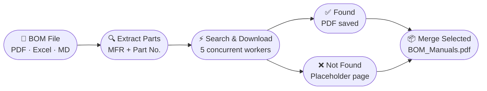

<div align="center">

# 📦 BOM Manual Downloader

**Automatically fetches datasheets for every part in your Bill of Materials and merges them into one clean, ordered PDF.**

[](https://python.org)
[](https://github.com)
[](LICENSE)
[](https://pywebview.flowrl.com)
[]()

</div>

---

## 🔄 How It Works



---

## ✨ Features

<table>
<tr>
<td width="50%">

### 📥 Smart Downloading
- Reads **PDF, Excel and Markdown** BOMs
- Probes manufacturer CDNs directly before web search
- **Concurrent downloads** — 5 parallel workers by default
- Live per-part status: Searching → Found / Not Found

</td>
<td width="50%">

### 📄 Professional PDF Output
- **Cover page** listing every part with ✓ Found / ✗ Not Found
- Per-part **divider pages** for easy navigation
- "Document Not Found" placeholder pages for missing items
- Cancel mid-run and still get a usable result

</td>
</tr>
<tr>
<td width="50%">

### ✅ Selective Merging
- Results page shows a **checkbox** for every found manual
- All found parts are pre-checked — uncheck what you don't need
- Uses exact recorded download paths — never picks up stale files
- Outputs a clean `BOM_Manuals_Selected.pdf`

</td>
<td width="50%">

### 🔀 Standalone PDF Merger
- Merge **any PDFs** from your filesystem independently
- Drag-and-drop file list with ↑ ↓ reordering
- Drag files onto the drop zone or click to browse
- Fully separate from the BOM workflow

</td>
</tr>
</table>

---

## 🚀 Getting Started

### Prerequisites

- Python **3.10** or newer
- Windows (uses the system WebView2 / Edge runtime)

### Install & Run

```bash
# 1. Clone
git clone https://github.com/your-username/BomDownloader.git
cd BomDownloader

# 2. Install dependencies
pip install -r requirements.txt

# 3. Launch
python main.py
```

### `requirements.txt`

| Package | Purpose |
|---------|---------|
| `pywebview >= 4.4.1, < 5.0` | Native desktop window |
| `pdfplumber >= 0.10.0` | Extract text from PDF BOMs |
| `pypdf >= 3.17.0` | Merge and manipulate PDFs |
| `reportlab >= 4.0.0` | Generate cover, divider & placeholder pages |
| `openpyxl >= 3.1.0` | Read Excel BOMs |
| `requests >= 2.31.0` + `beautifulsoup4 >= 4.12.0` | Download & scrape manufacturer sites |
| `ddgs >= 6.1.0` | DuckDuckGo search — free, no key needed |

---

## 📖 Workflow

```
┌─────────────────────────────────────────────────────────────┐
│  Step 1 — Input      Load a PDF, Excel, or Markdown BOM     │
│  Step 2 — Parts      Review extracted manufacturers & P/Ns  │
│  Step 3 — Download   Watch live progress, cancel any time   │
│  Step 4 — Results    Check the manuals you want → Merge     │
└─────────────────────────────────────────────────────────────┘
```

> **Cancelled a run?** The Results page still shows everything that was
> downloaded with checkboxes, so you can merge partial results immediately.

---

## 📂 Output PDF Structure

```
BOM_Manuals_Selected.pdf
│
├── Cover Page ─────── all parts listed with ✓ Found / ✗ Not Found / Skipped
│
├── ── Part 001 ──  RITTAL  8108245
│   └── [manual pages]
│
├── ── Part 002 ──  HONEYWELL  FC-PDB-0824P
│   └── [manual pages]
│
└── ── Part 003 ──  MOXA  MB3270I-T
    └── DOCUMENT NOT FOUND — please source this document manually
```

---

## 🔑 Optional Search Backends

Works out of the box with **DuckDuckGo + DirectProbe** (free, no setup needed).
For higher hit rates on larger BOMs, add API keys in `bom_downloader.py`:

<details>
<summary><b>🔧 Click to expand API key configuration</b></summary>

<br/>

| Provider | Variable(s) | Free Tier | Link |
|----------|-------------|-----------|------|
| **Nexar** | `NEXAR_CLIENT_ID` / `NEXAR_CLIENT_SECRET` | 1,000 / month | [nexar.com/api](https://nexar.com/api) |
| **Google CSE** | `GOOGLE_CSE_KEY` / `GOOGLE_CSE_CX` | 100 / day | [console.cloud.google.com](https://console.cloud.google.com) |
| **Bing Search** | `BING_API_KEY` | 1,000 / month | [Azure Portal](https://portal.azure.com) |
| **Mouser** | `MOUSER_API_KEY` | Free | [mouser.com/api-hub](https://www.mouser.com/api-hub) |
| **Farnell / element14** | `FARNELL_API_KEY` | Free | [partner.element14.com](https://partner.element14.com) |
| **Serper** | `SERPER_API_KEY` | 2,500 / month | [serper.dev](https://serper.dev) |
| **Tavily** | `TAVILY_API_KEY` | 1,000 / month | [app.tavily.com](https://app.tavily.com) |
| **Exa** | `EXA_API_KEY` | 1,000 / month | [dashboard.exa.ai](https://dashboard.exa.ai) |
| **Brave Search** | `BRAVE_API_KEY` | $3 / 1,000 | [brave.com/search/api](https://brave.com/search/api) |

Leave any field blank to skip that backend. A built-in **circuit breaker** automatically disables a backend after 3 consecutive failures — one bad API key won't slow down the entire run.

</details>

---

## 🗂️ Project Structure

```
BomDownloader/
├── main.py              ← Entry point — boots the pywebview window
├── api.py               ← Python ↔ JS bridge (all pyapi() calls)
├── bom_downloader.py    ← Core engine: BOM parsing, search, download, PDF merge
├── index.html           ← Complete frontend (HTML + CSS + JS, single file)
└── requirements.txt
```

---

## ⚙️ Settings

| Setting | Default | Description |
|---------|---------|-------------|
| Output folder | `Documents\BOM Manuals` | Where downloads and merged PDFs are saved |
| Worker threads | `5` | Number of parallel download connections |
| Skip merging | Off | Download files only, skip the merge step |

---

## 📦 Build a Standalone Executable

```bash
pip install pyinstaller
pyinstaller --onefile --windowed --name BomDownloader main.py
```

The app uses `sys._MEIPASS` to locate bundled assets automatically when frozen — no extra config needed.

---

## 📜 License

Released under the [MIT License](LICENSE). Free to use, modify, and distribute.

---

<div align="center">
  <sub>Built with Python · pywebview · pypdf · reportlab · DuckDuckGo</sub>
</div>
